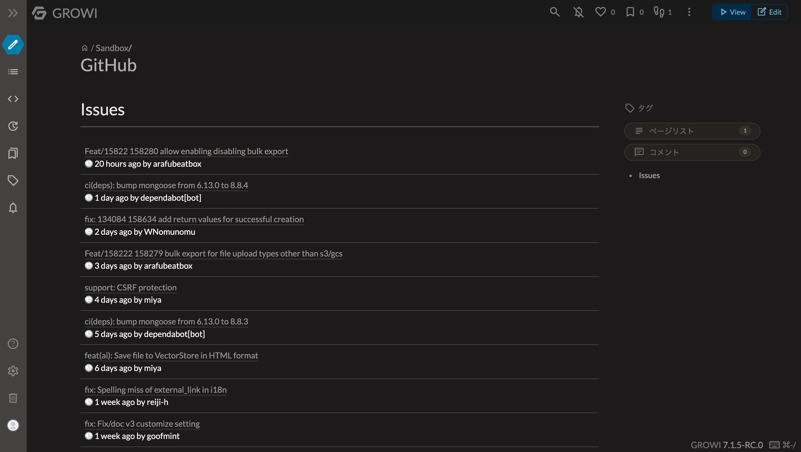

# GROIW Plugin GitHub

This is a GROWI plugin to access GitHub API

## Usage

### Issue
  
```
::github[issue]{repo=weseek/growi per_page=10}
```



You can use the following options by [REST API endpoints for issues \- GitHub Docs](https://docs.github.com/en/rest/issues/issues?apiVersion=2022-11-28).

### Query Parameters

| Name      | Type    | Description                                                                                                                                                                                                 |
|-----------|---------|-------------------------------------------------------------------------------------------------------------------------------------------------------------------------------------------------------------|
| milestone | string  | If an integer is passed, it should refer to a milestone by its number field. If the string `*` is passed, issues with any milestone are accepted. If the string `none` is passed, issues without milestones are returned. |
| state     | string  | Indicates the state of the issues to return. Default: `open`. Possible values: `open`, `closed`, `all`.                                                                                                      |
| assignee  | string  | Can be the name of a user. Pass in `none` for issues with no assigned user, and `*` for issues assigned to any user.                                                                                         |
| creator   | string  | The user that created the issue.                                                                                                                                                                             |
| mentioned | string  | A user that's mentioned in the issue.                                                                                                                                                                        |
| labels    | string  | A list of comma-separated label names. Example: `bug,ui,@high`.                                                                                                                                              |
| sort      | string  | What to sort results by. Default: `created`. Possible values: `created`, `updated`, `comments`.                                                                                                              |
| direction | string  | The direction to sort the results by. Default: `desc`. Possible values: `asc`, `desc`.                                                                                                                        |
| since     | string  | Only show results that were last updated after the given time. This is a timestamp in ISO 8601 format: `YYYY-MM-DDTHH:MM:SSZ`.                                                                               |
| per_page  | integer | The number of results per page (max 100). For more information, see "Using pagination in the REST API." Default: `30`.                                                                                       |
| page      | integer | The page number of the results to fetch. For more information, see "Using pagination in the REST API." Default: `1`.                                                                                         |


## Notice

This plugin does not support GitHub API Key. GitHub API key does not required, but the rate limit is limited.

## License

MIT

